# 📈 AssetPulse

一款基于 **Electron + Vue 3 + TypeScript** 的**迷你**桌面理财持仓监控工具，支持 **A 股**、**场外基金**、**金银行情**。

> Designed by **Croyell** 🌙

---

## ✨ 功能特性

### 🫧 悬浮球模式

- 随时可收缩为 **80×80** 透明悬浮球形式常驻桌面顶层
- 支持实时展示 **A 股当日总盈亏**、**实时金价**

### 📊 A 股实时行情

- 接入 **实时财经行情接口**，支持 A 股（上海 / 深圳 / 北交所）全市场
- 行情数据 **每秒自动刷新**，包含最新价、昨收价、涨跌额、涨跌幅等信息
- 支持**排序、调仓、自定义价格提醒**等操作

### 💹 场外基金

- 支持场外基金实时净值估算
- 表格展示：净值(NAV)、持仓盈亏(PnL)、日涨幅(Chg%)、收益率(Yield)、持有天数(Days)/持仓市值(Val)
- 同样支持 **排序、调仓**等操作
- 默认隐藏，可在设置"模块显示"中自定义选择开启

### 🟨 金银行情
- **实时监控**：实时获取伦敦金 (XAU/USD)、伦敦银 (XAG/USD) 价格。
- **货币切换**: 可自由切换货币 CNY/USD，自动按实时汇率换算为克价（¥/g）或美元/盎司（$/oz）。
- **黄金持仓**：只支持黄金持仓，查看**当日盈亏**、**持仓成本**、**持仓市值**、**持仓手数**等信息。
- **黄金调仓**：未持仓时点击“初始化持仓”快速录入；已持仓后，支持通过底部中心操作栏进行 **加仓 / 减仓 / 一键清仓**。

### ⚙️ 系统设置 & 关于

- **多语言支持**
- **置顶显示**
- **热键录制**
- **模块显示**：三模块自定义选择开启
- **关于界面 & 版本更新**
- **自动检测版本更新**

### 🪟 无边框沉浸窗口

- 完全 **无边框透明** 窗口，圆角暗色主题，极致沉浸
- 窗口大小随内容区动态 **自适应调整**，阴影与边距适配无死角

---

## 📸 产品截图

### 🪟 窗口大小对比
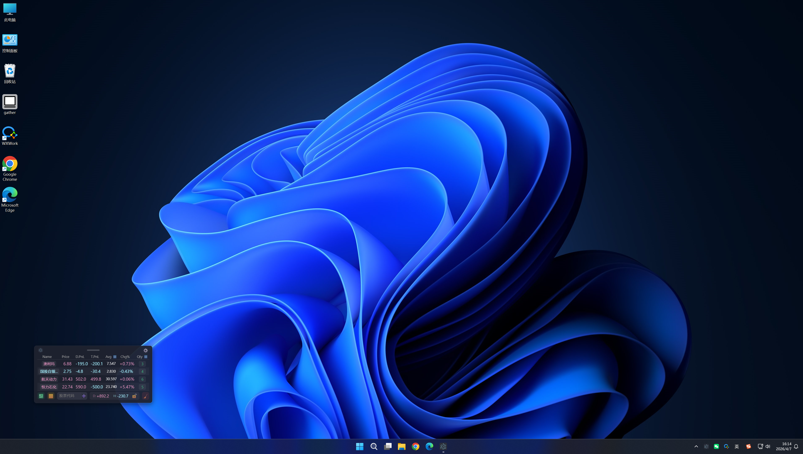

### 🫧 悬浮球例图
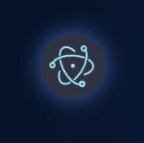
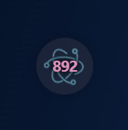

### 📊 股票例图
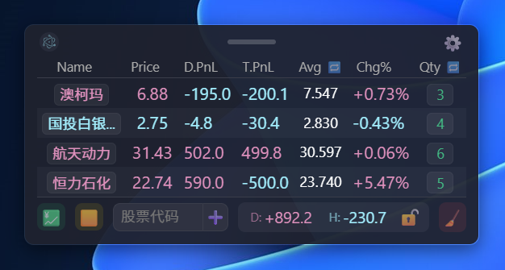
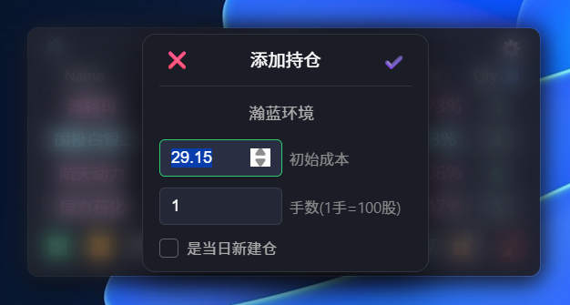
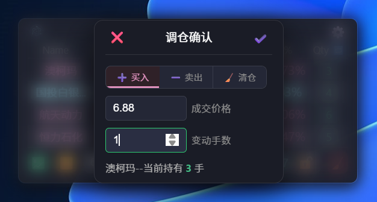
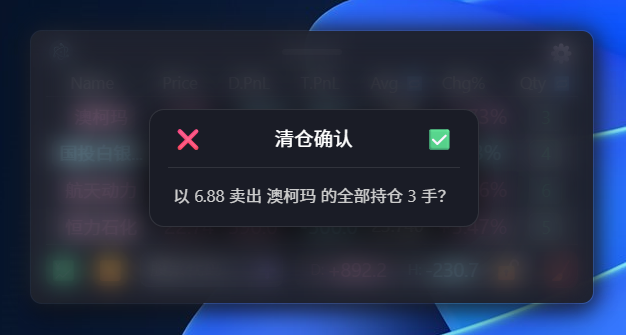

### 💹 基金例图
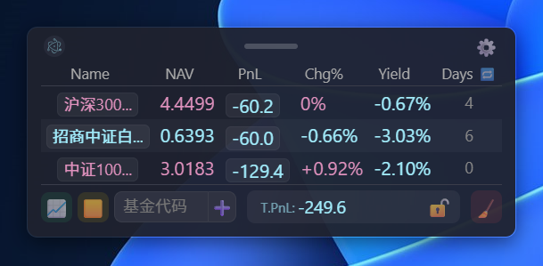
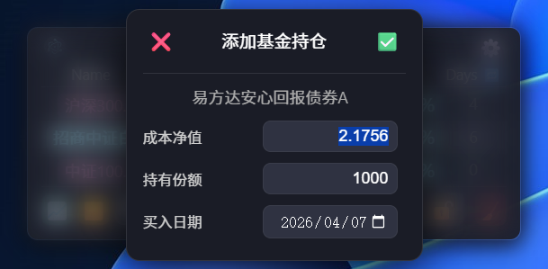

### 🟨 黄金例图
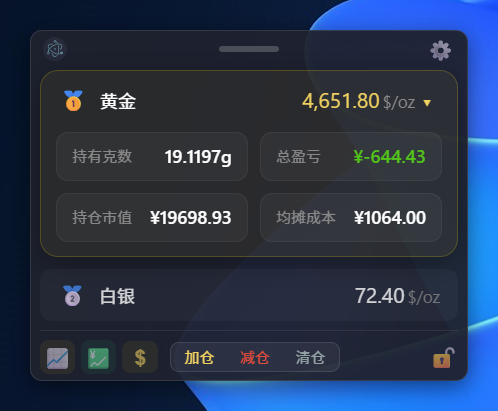

### ⚙️ 设置例图
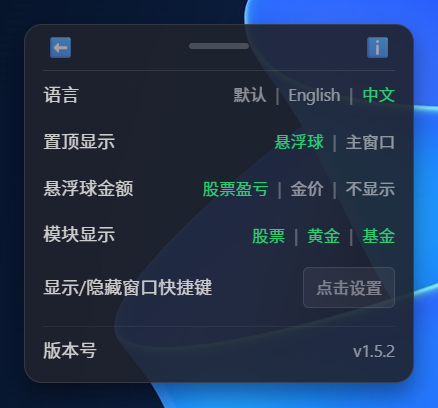

---

## 🛠️ 技术栈

| 分类 | 技术                                                                        |
| ---- | --------------------------------------------------------------------------- |
| 框架 | [Electron](https://www.electronjs.org/) 39 + [Vue 3](https://vuejs.org/)    |
| 语言 | [TypeScript](https://www.typescriptlang.org/)                               |
| 构建 | [electron-vite](https://electron-vite.org/) + [Vite](https://vitejs.dev/) 7 |
| 路由 | [Vue Router](https://router.vuejs.org/) 4                                   |
| 国际化 | [vue-i18n](https://vue-i18n.intlify.dev/) 11                                |
| 打包 | [electron-builder](https://www.electron.build/)                             |
| 更新 | [electron-updater](https://www.electron.build/auto-update)                  |
| 规范 | ESLint + Prettier                                                           |

---

## 📁 主要项目结构

```
investment-monitor/
├── src/
│   ├── main/               # Electron 主进程 (窗口、路由、IPC、快捷键、自动更新)
│   ├── preload/            # 预加载脚本
│   └── renderer/           # 渲染进程 (Vue 应用视图层)
│       └── src/
│           ├── views/      # 核心视图
│           │   ├── MainList.vue     # A 股盯盘主面板
│           │   ├── GoldView.vue     # 贵金属行情面板
│           │   ├── FundView.vue     # 场外基金面板
│           │   ├── FloatingBall.vue # 悬浮球
│           │   ├── Setting.vue      # 偏好设置
│           │   └── About.vue        # 关于及版本更新
│           ├── components/ # 独立及高复用组件
│           │   ├── DragHandle.vue   # 跨进程系统窗口拖拽条
│           │   ├── Modal.vue        # 输入及确认模态框
│           │   ├── FundEditModal.vue # 基金持仓编辑弹窗
│           │   ├── Confirm.vue      # 危险操作拦截确认框
│           │   ├── Toast.vue        # 消息提示气泡
│           │   └── ToggleSwitch.vue # 开关组件
│           ├── locales/    # 国际化语言文件 (zh / en / default)
│           ├── router/     # Vue 路由控制器
│           └── assets/     # 静态应用资源
├── electron-builder.yml    # 打包定义配置
└── electron.vite.config.ts # Vite 构建配置
```

---

## 🚀 快速开始

### 环境要求

- [Node.js](https://nodejs.org/) >= 18
- npm >= 9

### 安装依赖

```bash
npm install
```

### 开发调试

```bash
npm run dev
```

> 启动后将自动打开 Electron 窗口，支持 HMR 热更新。按 `F12` 可在任意窗口呼出控制台面板调试。

### 生产构建与发布

本项目的打包命令已默认集成 `--publish always`。如果需要打包后自动将安装包推送到 GitHub Release 以供用户在线更新，请先在当前环境（或 CI/CD 中）配置好具有 `repo` 权限的变量 `GH_TOKEN`：

```bash
# Windows
npm run build:win

# macOS
npm run build:mac

# Linux
npm run build:linux
```

---

## 📜 推荐 IDE

- [VS Code](https://code.visualstudio.com/) + [ESLint](https://marketplace.visualstudio.com/items?itemName=dbaeumer.vscode-eslint) + [Prettier](https://marketplace.visualstudio.com/items?itemName=esbenp.prettier-vscode) + [Volar](https://marketplace.visualstudio.com/items?itemName=Vue.volar)

---

## 📄 License

MIT
